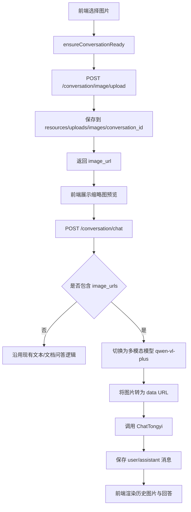

# LLM RAG 项目图片识别能力开发文档

## 1. 背景

当前项目已经具备以下能力：

- 会话创建、会话列表、会话详情、历史消息持久化。
- 文档上传、文本解析、按会话构建 FAISS 索引，并在会话问答时做 RAG 召回。
- 基于通义千问 qwen-plus 的对话能力，以及 agent 模式下的工具调用能力。
- 前端单页会话界面，支持新建会话、上传文档、发送文本消息、查看历史消息。

本次要补充的能力是：让用户在当前会话中上传图片，并让模型基于图片内容回答问题，例如：

- 识别图片中有什么。
- 概括截图、图表、海报、界面、商品图里的关键信息。
- 结合当前会话中的文档上下文，对图片进行解释。

本次设计目标是：在尽量少改动现有结构的前提下，为项目补齐一套可维护、可扩展、可回归测试的图片识别链路。

## 2. 现状确认

结合当前代码，和本次改造直接相关的事实如下。

### 2.1 后端接口现状

[app/router/router.py](app/router/router.py) 当前已注册的核心接口包括：

- /conversation/create
- /conversation/list
- /conversation/detail
- /conversation/chat
- /document/upload
- /document/delete

当前没有图片上传接口，也没有图片静态访问接口。

### 2.2 会话聊天现状

[app/handler/conversation_handler.py](app/handler/conversation_handler.py) 的 chat 入口当前只接收以下字段：

- conversation_id
- query
- mode

它没有 image_urls 或 image_assets 等图片参数。

[app/services/conversation_chat_service.py](app/services/conversation_chat_service.py) 当前特点如下：

- 统一使用 ChatTongyi(model="qwen-plus")。
- agent 模式通过 bind_tools 绑定工具。
- 历史消息通过 _build_history 组装，当前仅支持纯文本 HumanMessage / AIMessage。
- append_message_pair 持久化的 user_content、assistant_content 都是纯文本。

这意味着图片识别不是“加一个前端按钮”就够，必须同时改接口协议、服务层消息组装和前端渲染。

### 2.3 前端现状

[app/templates/index.html](app/templates/index.html) 和 [app/static/js/conversation_index.js](app/static/js/conversation_index.js) 当前支持：

- 新建会话。
- 上传文档。
- 输入文本并发送。
- 按历史消息回放文本。

当前前端有两个重要限制：

- 消息渲染使用 jQuery 的 text 字段写入，实际是纯文本展示，不支持 Markdown，不会自动渲染图片。
- 上传文档要求当前已经存在 conversation_id，图片如果也采用“先上传再发送”的模式，则必须先保证会话已创建。

### 2.4 持久化现状

[app/services/conversation_store_service.py](app/services/conversation_store_service.py) 当前的消息持久化逻辑是：

- 每轮写两条消息：user、assistant。
- 首轮会将用户消息前 20 个字符用作会话标题。
- 会话摘要使用 assistant 返回内容前 500 个字符。

因此如果直接把图片 Markdown 原样塞进用户 content，需要额外处理标题提取逻辑，否则可能出现标题被  污染的问题。

## 3. 目标与范围

## 3.1 本期目标

本期只做“图片作为对话输入”的能力，具体包括：

- 用户可以在某个会话里上传图片。
- 前端能在发送前展示图片缩略图预览。
- 发送消息时可携带 1 张或多张图片。
- 后端能将图片转换为多模态模型可识别的输入格式，并返回识别结果。
- 图片消息与文本消息一起进入会话历史。
- 重新打开会话时，历史图片能够再次展示。

## 3.2 本期不做

为了控制改造范围，本期明确不做以下内容：

- 不把图片内容做 OCR 后写入 FAISS 检索库。
- 不做“以图搜图”。
- 不做图片向量化检索。
- 不做视频识别。
- 不做图片编辑、标注、裁剪。
- 不做复杂权限控制。

后续如果需要，可以在第二阶段扩展为“图片 OCR + 文档索引融合检索”。

## 4. 方案选择

## 4.1 方案候选

### 方案 A：图片走 document/upload，复用文档链路

思路：把图片也当文档上传，然后走现有文档解析和索引流程。

问题：

- 当前 document/upload 的职责是“解析文本并进入索引”，不适合承载纯视觉理解。
- 图片不一定需要进入 FAISS，强行复用会让 document_parser_service 和 document_index_service 变复杂。
- 图片理解本质是多模态推理，不是文本解析。

结论：不推荐。

### 方案 B：新增独立图片上传接口，并在会话聊天时携带 image_urls

思路：

- 图片先上传到本地 resources/uploads/images/会话目录。
- 前端拿到图片访问地址后暂存在当前输入态。
- 用户点击发送时，将文本 query 和 image_urls 一并传给 /conversation/chat。
- 后端检测到 image_urls 后，改用多模态模型调用。

优点：

- 与现有文档上传职责分离。
- 对现有会话结构侵入小。
- 后续可平滑扩展到多图、多轮多模态历史。

结论：采用方案 B。

## 4.2 本期最终方案

本期采用以下设计：

- 新增图片上传接口：POST /conversation/image/upload
- 新增图片访问接口：GET /conversation/image/<conversation_id>/<filename>
- 扩展聊天接口请求体：增加 image_urls 字段
- 图片文件保存到 resources/uploads/images/<conversation_id>/
- 会话消息仍复用现有 conversation_messages 表，不新增消息表结构
- 用户消息内容以“图片 Markdown + 文本”的方式持久化
- 历史回放时前端将消息内容按安全白名单渲染为 HTML
- 只要请求中带图片，就不走当前 agent 的工具调用链，直接调用多模态模型

这里特别强调两点：

1. 不建议暴露整个 resources 目录为静态目录。
原因：resources 下还有索引、解析结果、历史资源等，不应该全部开放给浏览器访问。

2. 不建议图片请求继续走 bind_tools 后的 agent_llm。
原因：当前 agent 模式基于 qwen-plus + tools，图片输入下能否稳定兼容 tool_calls 不确定。本期应优先保证图片识别链路稳定，直接调用多模态模型更可靠。

## 5. 总体架构



## 6. 详细设计

## 6.1 文件存储设计

新增图片存储目录：

- resources/uploads/images/<conversation_id>/

命名规则建议：

- img_<uuid12>.<ext>

例如：

- resources/uploads/images/conv_20260609143000_ab12cd/img_f83a22de98ad.png

设计原则：

- 目录按 conversation_id 隔离，便于清理和追踪。
- 文件名随机化，避免用户原始文件名中的特殊字符和重名冲突。
- 只允许白名单图片后缀：png、jpg、jpeg、webp。
- 第一版不建议支持 gif 动图，避免后续模型输入和浏览器展示行为不一致。

## 6.2 接口设计

### 6.2.1 图片上传接口

接口：POST /conversation/image/upload

请求格式：multipart/form-data

请求参数：

- conversation_id: string，必填
- file: 文件，必填，单张图片

返回示例：

```json
{
  "code": 200,
  "message": "图片上传成功",
  "data": {
    "image_url": "/conversation/image/conv_20260609143000_ab12cd/img_f83a22de98ad.png",
    "filename": "img_f83a22de98ad.png",
    "mime_type": "image/png"
  }
}
```

校验规则：

- conversation_id 不能为空。
- file 不能为空。
- 扩展名必须在白名单中。
- MIME 类型必须以 image/ 开头。
- 文件大小受 app.config["MAX_CONTENT_LENGTH"] 限制。

失败示例：

- 会话不存在。
- 文件类型不支持。
- 空文件。
- 路径非法。

### 6.2.2 图片访问接口

接口：GET /conversation/image/<conversation_id>/<filename>

用途：

- 给前端预览和历史回放使用。
- 只暴露图片目录，不暴露整个 resources 目录。

安全要求：

- conversation_id 和 filename 必须做路径安全校验。
- 使用 send_from_directory，只指向 resources/uploads/images/<conversation_id>。
- filename 使用 secure_filename 结果对比原值，拒绝目录穿越。

### 6.2.3 会话聊天接口扩展

接口仍然使用：POST /conversation/chat

新增请求体字段：

- image_urls: list[string]，可选

请求示例：

```json
{
  "conversation_id": "conv_20260609143000_ab12cd",
  "query": "请描述这张图片里的主要信息，并判断这是不是一个电商商品页截图",
  "mode": "agent",
  "image_urls": [
    "/conversation/image/conv_20260609143000_ab12cd/img_f83a22de98ad.png"
  ]
}
```

服务端行为：

- image_urls 为空时，沿用当前逻辑。
- image_urls 非空时，进入多模态聊天逻辑。
- image_urls 非空时，忽略 agent 工具调用，直接调用多模态模型。

## 6.3 持久化设计

本期不新增表，直接复用现有 conversation_messages 表。

### 6.3.1 用户消息存储格式

建议将用户消息存储为：

```text

请描述图片里的内容
```

实际落库时不要保留括号内多余空格，规范格式如下：

```text

请描述图片里的内容
```

如果有多张图，则按顺序拼接：

```text


请比较这两张图的差异
```

这样做的原因：

- 不需要改数据库表结构。
- 历史消息天然可回放。
- 服务端可以通过正则从 content 中提取图片 URL，恢复为多模态历史消息。

### 6.3.2 标题与摘要处理

需要同步修改 [app/services/conversation_store_service.py](app/services/conversation_store_service.py) 中的标题生成逻辑。

当前逻辑直接截 user_content 的前 20 个字符，这会导致首轮消息如果带图片 Markdown，会话标题变成：

-  片段
- 再 trim
- 再截取前 20 个字符作为标题

assistant 的 last_message_preview 逻辑可以保持不变。

## 6.4 服务层设计

### 6.4.1 ConversationHandler 扩展

修改 [app/handler/conversation_handler.py](app/handler/conversation_handler.py)：

- 新增 upload_image 方法
- 修改 chat 方法，读取 image_urls 字段

chat 新逻辑：

- 从 request JSON 里读取 image_urls = data.get("image_urls") or []
- 校验 image_urls 是 list
- 调用 conversation_chat_service.chat(conversation_id, query, mode, image_urls)

### 6.4.2 ConversationChatService 扩展

修改 [app/services/conversation_chat_service.py](app/services/conversation_chat_service.py)。

当前 chat 签名为：

```python
def chat(self, conversation_id: str, query: str, mode: str = "agent") -> dict:
```

建议改为：

```python
def chat(self, conversation_id: str, query: str, mode: str = "agent", image_urls: list[str] | None = None) -> dict:
```

新增能力：

- 初始化多模态模型实例 self.vl_llm
- 新增 _encode_image_url_to_data_url
- 新增 _build_multimodal_history
- 新增 _compose_user_content
- 新增 _strip_image_markdown

#### a. 模型初始化

在 _ensure_initialized 中增加：

- self.vl_llm = ChatTongyi(model="qwen-vl-plus", temperature=0.7)

配置项不要写死，建议在各环境配置中增加：

- MULTIMODAL_MODEL = "qwen-vl-plus"

#### b. 图片 URL 转 data URL

由于模型不能依赖本地浏览器可访问地址，建议后端调用模型前直接把图片文件读出并转成 data URL：

```python
import base64
import mimetypes
import os


def _encode_image_url_to_data_url(self, image_url: str) -> str:
    # image_url 形如 /conversation/image/<conversation_id>/<filename>
    parts = image_url.strip('/').split('/')
    if len(parts) != 4 or parts[0] != 'conversation' or parts[1] != 'image':
        raise ValueError('非法图片地址')

    conversation_id = parts[2]
    filename = parts[3]
    image_dir = ResourceUtils.get_resource_path(os.path.join('uploads', 'images', conversation_id))
    image_path = os.path.join(image_dir, filename)

    with open(image_path, 'rb') as f:
        raw = f.read()

    mime_type, _ = mimetypes.guess_type(image_path)
    mime_type = mime_type or 'image/png'
    encoded = base64.b64encode(raw).decode('utf-8')
    return f'data:{mime_type};base64,{encoded}'
```

#### c. 多模态消息组装

当 image_urls 非空时，用户输入需要从纯文本 HumanMessage 改为多段内容：

```python
content_parts = []
for image_url in image_urls:
    content_parts.append({
        "type": "image_url",
        "image_url": {"url": self._encode_image_url_to_data_url(image_url)}
    })
content_parts.append({
    "type": "text",
    "text": f"相关文档内容：{context}\n\n用户问题：{query}"
})
```

然后调用多模态模型：

```python
response = self.vl_llm.invoke(history_messages + [HumanMessage(content=content_parts)])
answer = response.content
```

#### d. 历史消息恢复

为了让历史图片在下一轮多模态对话中仍可被模型理解，需要把历史用户消息里的图片 Markdown 再解析出来。

建议新增辅助函数：

- 从 content 中提取所有图片链接
- 删除图片 Markdown 后得到 clean_text
- 重新组装 HumanMessage(content=[...])

注意：

- 历史里只有用户消息需要做图片提取。
- assistant 消息仍然是纯文本。
- 如果历史图片文件已经不存在，要忽略该图片，不能让整轮请求失败。

### 6.4.3 agent 模式的处理原则

当前前端默认 mode 固定传 agent，但图片请求不建议继续经过当前 _invoke_agent。

本期建议逻辑：

- 没有图片：mode 维持原逻辑。
- 有图片：即使 mode=agent，也直接走 vl_llm，不走 tools。

原因：

- 降低首版实现复杂度。
- 避免多模态 + tool_calls 同时接入时带来额外不确定性。
- 用户实际诉求是“识别图片”，不是“带工具的图片代理”。

## 6.5 前端设计

### 6.5.1 HTML 修改点

修改 [app/templates/index.html](app/templates/index.html)，在输入区增加：

- 隐藏的图片选择 input
- 图片上传按钮
- 图片预览容器

建议结构：

```html
<input type="file" id="imageInput" class="hidden-file-input" accept="image/png,image/jpeg,image/webp">

<div id="imagePreviewContainer" class="image-preview-container"></div>

<button type="button" class="icon-button" id="triggerImageUpload" aria-label="上传图片">
    <span>图片</span>
</button>
```

图片按钮可以直接放入现有 .composer-actions 区域，不需要新开一整块布局。

### 6.5.2 JavaScript 修改点

修改 [app/static/js/conversation_index.js](app/static/js/conversation_index.js)。

state 新增字段：

- pendingImageUrls: []

新增流程：

1. 点击上传图片按钮时，触发 #imageInput。
2. 选择图片后先调用 ensureConversationReady()。
3. 会话准备好之后再调用 /conversation/image/upload。
4. 上传成功后，把 image_url 推入 pendingImageUrls。
5. 在输入区显示缩略图预览，并提供移除按钮。
6. 点击发送时，将 pendingImageUrls 一并提交给 /conversation/chat。
7. 发送成功后清空 pendingImageUrls 和预览区。

这里必须注意一个现有事实：

- 当前 uploadDocument 只有在 state.currentConversationId 已存在时才能上传。
- 图片上传如果不先 ensureConversationReady，会在“新建页面还没选会话时”直接失败。

因此图片上传逻辑必须先保证会话存在。

### 6.5.3 消息渲染方案

当前 appendUserMessage 和 appendAssistantMessage 用的是：

- $('<p/>', { text: text })

这会导致图片 Markdown 只能原样显示，不能显示成图片。

因此本期前端必须增加一层安全渲染。

推荐方案：

- 引入 marked.js 负责 Markdown 转 HTML。
- 引入 DOMPurify 对 HTML 做净化。
- 仅允许常用标签，重点允许 img、p、br、ul、ol、li、strong、em。

推荐渲染函数：

```javascript
function renderMessageHtml(text) {
    var markdown = normalizeMessage(text || '');
    var html = marked.parse(markdown, { breaks: true });
    return DOMPurify.sanitize(html);
}
```

然后把消息渲染从 text 改成 html：

```javascript
$('<div/>', { 'class': 'chat-message', html: renderMessageHtml(text) })
```

如果暂时不想引入 Markdown 库，也至少要实现一个最小渲染器：

- 将换行转 br
- 将  转 img

但从可维护性看，推荐直接使用成熟库。

### 6.5.4 样式设计

修改 [app/static/css/style.css](app/static/css/style.css)，增加：

- 输入区图片预览样式
- 历史消息中图片缩略图样式
- 图片 hover 样式
- 多张图片时的横向或换行布局

建议约束：

- 消息中的图片 max-width 240px
- border-radius 8px
- object-fit cover
- 预览图与历史图使用同一套边框和圆角语言

## 7. 代码改造清单

本期预计改动以下文件。

### 必改文件

- [app/router/router.py](app/router/router.py)
- [app/handler/conversation_handler.py](app/handler/conversation_handler.py)
- [app/services/conversation_chat_service.py](app/services/conversation_chat_service.py)
- [app/services/conversation_store_service.py](app/services/conversation_store_service.py)
- [app/templates/index.html](app/templates/index.html)
- [app/static/js/conversation_index.js](app/static/js/conversation_index.js)
- [app/static/css/style.css](app/static/css/style.css)
- [config/config_dev.py](config/config_dev.py)
- [config/config_test.py](config/config_test.py)
- [config/config_pre.py](config/config_pre.py)
- [config/config_prod.py](config/config_prod.py)

### 建议新增文件

- app/services/image_asset_service.py
用途：封装图片保存、路径校验、URL 生成、data URL 编码逻辑。

如果希望减少文件数量，也可以先把逻辑写进 conversation_handler 和 conversation_chat_service，但从长期维护性看，建议抽服务类。

### 建议新增测试

- test_tools/test_image_message_format.py
- test_tools/test_image_upload_handler.py
- test_tools/test_multimodal_history_parse.py
- test_tools/test_frontend_message_render.js

其中最后一个文件当前已存在，可在其基础上增加“图片 Markdown 应被渲染成 img”的断言。

## 8. 推荐开发步骤

建议按以下顺序落地，避免前后端同时大改导致排查困难。

### 第 1 步：后端图片上传与访问链路打通

目标：先能上传并访问图片。

改动：

- router 注册 upload_image、serve_image 两个接口
- handler 实现图片保存
- 本地浏览器可通过 image_url 看到图片

验收：

- POST 上传成功
- 浏览器访问返回的 image_url 能直接展示图片

### 第 2 步：聊天接口支持 image_urls

目标：后端能接收图片并切换多模态模型。

改动：

- conversation_handler.chat 增加 image_urls
- conversation_chat_service.chat 增加 image_urls 参数
- 加入 data URL 编码与多模态调用

验收：

- 传入图片后，模型能返回基于图片内容的回答
- 不传图片时，现有文档问答不受影响

### 第 3 步：消息持久化与历史恢复

目标：图片消息能进入历史，并在下轮继续参与上下文。

改动：

- 用户消息存储为图片 Markdown + query
- _build_history 支持解析图片 Markdown
- conversation_store_service 标题提取去除图片标签

验收：

- 发送一张图 + 文本后，刷新页面再打开会话，图片仍可见
- 后续继续追问时，模型仍知道上一轮引用过图片

### 第 4 步：前端图片上传与预览

目标：用户能够完整使用该能力。

改动：

- input type=file
- 预览容器
- pendingImageUrls 管理
- 发送时带 image_urls

验收：

- 页面上可选择图片
- 上传成功后显示预览
- 删除预览会同步移除待发送图片

### 第 5 步：前端消息富文本渲染

目标：历史图片真正显示在聊天消息里。

改动：

- 引入 Markdown 渲染与 HTML 净化
- appendUserMessage / appendAssistantMessage 改为 html 渲染

验收：

- 图片消息展示为实际图片，而不是 Markdown 文本
- 普通文本换行仍正常显示

## 9. 测试方案

## 9.1 后端单元测试

### 用例 1：图片扩展名校验

- 输入 png，成功
- 输入 jpg，成功
- 输入 pdf，失败
- 输入 exe，失败

### 用例 2：图片保存路径正确

- 上传后文件应写入 resources/uploads/images/<conversation_id>/
- 返回的 image_url 应包含 conversation_id 和文件名

### 用例 3：非法图片 URL 拒绝

- /conversation/image/../../xx
- /conversation/image/conv_xxx/../a.png
- 非法路径应直接返回错误或 404

### 用例 4：多模态消息组装正确

- image_urls 非空时，应生成包含 image_url 和 text 的 content parts
- image_urls 为空时，应继续走现有文本链路

### 用例 5：历史消息解析正确

- 含一张图的 Markdown 消息可还原为一张图 + 文本
- 含多张图的 Markdown 消息可按顺序还原
- 图片文件缺失时忽略该图片，但保留文本

### 用例 6：标题提取正确

- 首轮消息若包含图片 Markdown，标题应从真实文本中提取
- 没有文本时标题回退为“新对话”或“图片消息”

## 9.2 前端测试

可以在现有 [test_tools/test_frontend_message_render.js](test_tools/test_frontend_message_render.js) 基础上扩展：

- 校验 conversation_index.js 中发送聊天请求包含 image_urls
- 校验消息渲染路径已不再使用纯 text 输出图片消息
- 校验图片 Markdown 渲染后包含 img 标签

## 9.3 手工联调测试

至少验证以下场景：

1. 新打开页面，不手动新建会话，直接上传图片并发送问题。
2. 在已有会话中连续上传 2 张图片并提问。
3. 发送图片后刷新页面，再重新打开该会话。
4. 同一个会话既有文档，又有图片，再提问“结合文档和图片说明”。
5. 删除图片预览后发送，确认不会把已移除的图片带上。
6. 无图片的普通文本对话仍保持原有行为。

## 10. 风险与注意事项

### 10.1 不要开放整个 resources 目录

这是本次设计里最重要的安全点之一。

resources 目录中可能包含：

- 解析文本
- 向量索引
- 历史资源
- 其他不应该暴露的内部文件

因此只能开放图片子目录，不能用一个 /resources/<path> 路由把整个资源目录暴露出去。

### 10.2 前端渲染必须做 HTML 净化

如果把消息内容由纯 text 改成 html，而没有做净化，会引入 XSS 风险。

因此必须：

- Markdown 先转 HTML
- HTML 再经过 DOMPurify 等净化
- 不允许 script、style、onerror 等危险属性

### 10.3 图片请求的 agent 降级

当前 agent 模式本质上是“文本模型 + 工具调用”。

本期如果图片请求仍强制走 agent 工具链，会遇到：

- 多模态模型与工具调用是否兼容不明确
- 工具返回结果如何与多段内容继续拼装复杂度高

所以首版应明确：

- 图片请求走多模态直接问答
- 非图片请求继续走原 agent

### 10.4 文件大小控制

当前全局上传上限是 20MB。

图片识别场景建议进一步限制单图大小，例如：

- 单图不超过 5MB
- 单次最多 4 张

避免：

- 前端上传过慢
- 后端内存占用增大
- base64 后请求体急剧膨胀

## 11. 验收标准

满足以下条件即可认为本期开发完成：

- 用户可以在会话中上传 png/jpg/jpeg/webp 图片。
- 上传后前端出现可删除的图片预览。
- 发送消息时，后端能收到 image_urls 并返回基于图片内容的回答。
- 刷新页面后重新进入历史会话，图片消息能继续显示。
- 含图片消息不会破坏会话标题和摘要。
- 无图片场景下，现有文档上传、RAG 对话、普通文本聊天不受回归影响。

## 12. 后续迭代建议

如果本期上线稳定，下一阶段可继续扩展：

1. 图片 OCR 结果入库，参与会话检索。
2. 新增图片元数据表，替代 Markdown 嵌入式存储。
3. 支持截图、海报、表格、商品图等不同图片类型的专用提示词模板。
4. 支持多模态 agent，让图片理解结果和 web_search_tool、word_document_tool 联动。
5. 在前端支持点击图片放大预览。

## 13. 结论

基于当前项目结构，最合适的落地路径不是复用 document/upload，也不是开放整个 resources 目录，而是：

- 新增独立图片上传接口
- 为会话聊天增加 image_urls 协议
- 图片请求直接切换到多模态模型
- 使用“图片 Markdown + 文本”的方式复用现有消息持久化结构
- 在前端补齐图片预览和安全富文本渲染

这样可以在最小改造成本下，把“文本问答系统”升级为“文本 + 图片联合问答系统”，同时保持对现有会话、文档、RAG 能力的兼容。
